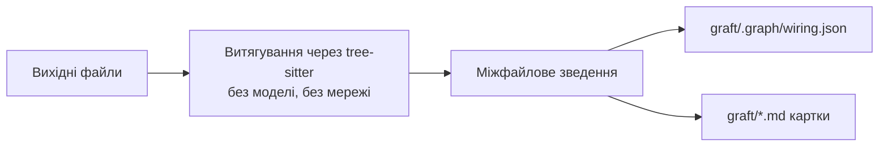

<div align="center">


[English](README.en.md) · **Українська**

### Нативний Go-контекст для Claude Code, Cursor, Codex, Gemini та будь-якого агента для програмування

<p><strong>Будуйте детерміновану карту кодової бази локально. Знаходьте потрібний код з меншою кількістю пошуків, читання файлів і витрачених токенів.</strong></p>

<p>
  
</p>

### До **4× дешевше** і **3× швидше** — з кращою або такою ж точністю

| Метрика | Claude Code без graft | Claude Code з graft |
|---|---|---|
| Менше викликів інструментів | Базовий рівень | **+46%** |
| Економія токенів | Базовий рівень | **+42%** |
| Економія часу | Базовий рівень | **+60%** |
| Точність | 54% | **66% (+12 п.п.)** |

</div>

<p align="center">
  <b>Це працює не лише з кодом.</b><br/>
  Живий файл навичок, який вчиться на кожній задачі й стає точнішим, що більше працює ваша команда.
</p>

<p align="center">
  
</p>

---

## Зміст

- [Встановлення і швидкий старт](#встановлення-і-швидкий-старт)
- [Проблема](#проблема)
- [Що робить Graft](#що-робить-graft)
- [Бенчмарк](#бенчмарк)
- [SWE-bench Verified](#swe-bench-verified)
- [Як будується граф](#як-будується-граф)
- [Підтримувані мови](#підтримувані-мови)
- [Що міститься в графі](#що-міститься-в-графі)
- [Що де виконується](#що-де-виконується)
- [Інтеграція з агентами](#інтеграція-з-агентами) — [MCP-сервер](#mcp-сервер) · [Claude Code](#claude-code)
- [CLI](#cli)
- [Пошук і орієнтування](#пошук-і-орієнтування-graft-grep--graft-map) (`graft grep` / `graft map`)
- [Монорепозиторії, сабмодулі та папки з кількома репозиторіями](#монорепозиторії-сабмодулі-та-папки-з-кількома-репозиторіями)
- [Перевірено на популярних репозиторіях](#перевірено-на-популярних-репозиторіях)
- [Розробка](#розробка)
- [Архітектура на Go](#архітектура-на-go)
- [Ліцензія](#ліцензія)

---

## Встановлення і швидкий старт

Graft — це один нативний Go-бінарник. Node.js потрібен лише для запуску невеликих шимів хуків і statusline, які `graft init` записує для Claude Code, Codex і Cursor.

### Встановлення через Go

Вимоги: **Go 1.27 або новіший** і робочий C-тулчейн, бо прив'язки Tree-sitter використовують cgo. Переконайтеся, що `$(go env GOPATH)/bin` є у вашому `PATH`.

```bash
go install github.com/h0rn3t/Graft/cmd/graft@latest
graft init
```

`graft init` питає, яких агентів підключити, будує локальний граф і додає інструкції для вибраних агентів, запис MCP, хуки та statusline там, де це підтримується. API-ключ не потрібен: увесь структурний робочий процес локальний і детермінований.

Поки ви не виберете агента, нічого не записується. Переглянути план можна так:

```bash
graft init --dry-run
```

Також можна підключити конкретного агента без запитання:

```bash
graft init --agents claude
```

`graft build` автоматично додає `graft/` у `.gitignore`. Граф — це локальний кеш, який можна перегенерувати, а у систему контролю версій варто класти лише невеликі файли підключення, створені `init`. Наприклад, для Claude Code:

```bash
git add .claude .mcp.json .gitignore
git commit -m "wire in graft"
```

Кожен учасник команди генерує власний локальний граф через `graft build` або `graft init`.

Щоб оновити встановлення, запустіть ту саму команду `go install ...@latest`.

### Встановлення останньої версії `main` через Go

`@latest` встановлює найновіший тегований реліз. Щоб запустити останній коміт `main`, завантажте його напряму з GitHub; `GOPROXY=direct` оминає кеш проксі модулів, тож ви отримаєте щойно запушений коміт:

```bash
GOPROXY=direct go install github.com/h0rn3t/Graft/cmd/graft@main
graft init
```

---

## Проблема

На кожній задачі агент починає наосліп. Перш ніж щось змінити, він заново досліджує репозиторій: шукає термін через grep, відкриває файл, іде за імпортом, повертається назад і пробує знову. Він відбудовує картину кодової бази, яку вже складав годину тому й викинув. Це повторне дослідження з'їдає більшість викликів інструментів, токенів і часу запуску, і все це чисті накладні витрати:

- **Повторюється.** Кожна задача знову платить за дослідження з нуля.
- **Губиться.** Усе, що агент з'ясував, зникає разом із сесією.
- **Не передається.** Наступний колега та його агент теж починають з нуля.

Люди знайомляться з кодовою базою один раз. Агенти — щоразу.

<p align="center">
  
</p>

---

## Що робить Graft

Graft один раз будує детерміновану структурну карту кодової бази і записує її у репозиторій як локальний кеш, який можна перегенерувати.

- **Символи та реальні зв'язки.** Tree-sitter витягує функції, класи, типи, імпорти, виклики й наслідування; Graft зводить їх у точний граф файлів і ребер.
- **Локальний кеш, а не закомічений артефакт.** `graft build` записує `graft/` і додає його в `.gitignore` — його можна будь-коли видалити й перегенерувати. Комітите ви лише невеликі файли підключення, які `graft init` додає до конфігурації агента.
- **Завжди актуальний, автоматично.** Команди-запити перед відповіддю оновлюють структурний граф відносно робочого дерева, тож незакомічені правки теж враховуються. `graft check` показує розбіжність, що залишилася, не змінюючи файлів.
- **Модель не потрібна.** `graft build`, `check`, `ask`, `grep`, `callers`, `skeleton`, `map` і `blast` працюють локально й детерміновано.

<p align="center">
  <picture>
    <source media="(prefers-color-scheme: dark)" srcset="assets/graft-cold-vs-graft-dark.png">
    
  </picture>
</p>

---

## Бенчмарк

Агент, який читає граф, має бути дешевшим і швидшим, не помиляючись частіше. У цьому вся суть, тож ми це виміряли, а не просто стверджуємо.

Тестовий стенд запускав три варіанти того самого агента Claude Sonnet 5 з однаковими файловими інструментами: **cold** (досліджує з нуля), **Graft** (пакет `graft ask --source`, переданий наперед) і **pull** (інструменти graft_find_code/graft_file_api, нічого не вставляється заздалегідь — за контекст платимо лише тоді, коли його запитують). Суддя Opus 4.8 оцінював точність з обов'язковим мінімумом ключових слів, щоб швидка, але хибна відповідь не могла виграти лише завдяки швидкості. Вартість рахується з урахуванням кешу: читання ≈0.1×, запис 1.25× — саме за такою моделлю тарифікації реально працюють агенти.

162 запуски, два репозиторії (сам graft і реальний сервіс авторизації на Node/Express), по 3 спроби, задачі розділені на однофайлові й багатофайлові питання.

| Метрика (середнє на задачу) | Claude Code без graft | Claude Code з graft |
|---|---|---|
| Економія коштів ($) | 0.0429 | **0.0292 (+32%)** |
| Економія токенів | 8,070 | **4,650 (+42%)** |
| Економія викликів інструментів | 4.2 | **2.3 (+46%)** |
| Економія затримки (с) | 39.8 | **15.8 (+60%)** |
| Точність | 93% | 93% (однаково) |

Graft жодного разу не відповів гірше, ніж cold, на жодному корпусі. Варіант pull віддав більшу частину цієї швидкості заради важливішого: точність зросла до 98%, на 5 пунктів вище за cold — найсильніший окремий результат у серії. Використовуйте push, коли потрібна швидкість; pull — коли важливіше бути правим.

---

## SWE-bench Verified

Серія вище — це наш стенд, що вимірює наш механізм. Тож ми запустили й галузевий стандарт — **SWE-bench Verified**: реальні GitHub-issue з реальних репозиторіїв, оцінені офіційним харнесом `swebench`. Жодної моделі-судді, жодної оцінки схожості: ваш патч застосовується, запускаються тести самих мейнтейнерів, і ви або виправляєте тест, що падав, не зламавши тих, що проходили, або ні.

**50 задач**, та сама модель в обох гілках — **Claude Sonnet 5** — ті самі Docker-образи, ті самі ліміти ходів. Єдина різниця — чи підключено graft.

| Точність і ефективність | Claude Code без graft | Claude Code з graft | Покращення |
|---|---|---|---|
| Точність | 27 / 50 (54%) | **33 / 50 (66%)** | **+12 п.п.** |
| Економія токенів | 142.0M | **109.4M** | **+23%** |
| Економія коштів | $52.34 | **$42.43** | **+19%** |
| Економія викликів інструментів | 1,370 | **1,031** | **+25%** |
| Економія API-запитів | 2,455 | **1,875** | **+24%** |
| Економія реального часу | 13,094s | **8,922s** | **+32%** |

graft розв'язав **33 з 50 задач** проти 27 у Claude Code без graft — і зробив це з на 25% меншою кількістю викликів інструментів, на 23% меншою кількістю токенів і на 32% меншим реальним часом. Кожен виграш у точності має однакову форму: базовий варіант патчить один файл і пропускає суміжні. На `django-11532` він виправив 1 з 5 файлів, яких потребує фікс, і зламав 18 тестів, що раніше проходили, — двічі. На `django-16263` він виправив 1 з 4 і отримав 102 / 103. graft знайшов решту — а на `django-16263` зробив це вдвічі швидше й за половину токенів.

Два стенди, два твердження: контрольована серія показує, що graft дешевший і швидший, а SWE-bench — що він ще й точніший.

<sub>Точність — по всіх задачах; токени, вартість і виклики — по задачах, які розв'язали обидві гілки, для рівного порівняння. Офіційні образи SWE-bench Verified і офіційний грейдер `swebench` 4.1.0, нативний x86_64.</sub>

---

## Як будується граф

Graft будує структурний граф повністю на вашій машині:

1. **Парсить підтримувані вихідні файли** через tree-sitter і витягує символи, діапазони, сигнатури, імпорти, виклики й наслідування.
2. **Зводить граф** між файлами, областями видимості, воркспейсами монорепозиторію та підтримуваними формами імпорту.
3. **Записує два подання**: `graft/.graph/wiring.json` для машинних запитів і markdown-картки для кожного файлу, які агенти читають і грепають.



Кожен розбір кешується за хешем вмісту, тож повторна збірка перечитує лише змінені файли. `graft build --no-reuse` примусово виконує холодний розбір.

Саме ця дешевизна дозволяє **кожному запиту оновлювати граф перед відповіддю**. Graft порівнює байти робочого дерева зі своїм відбитком і перебудовує граф лише тоді, коли щось змінилося, тож `ask`/`grep`/`callers`/`skeleton`/`map`/`blast` однаково описують незакомічені, непроіндексовані й проіндексовані правки. Вимкнути оновлення можна для окремої команди через `--no-refresh` або глобально через `GRAFT_NO_REFRESH=1`.

---

## Підтримувані мови

Нативний екстрактор Graft детермінований і локальний. Він підтримує:

- **Go**: `.go`
- **Python**: `.py`, `.pyi`
- **TypeScript / JavaScript**: `.ts`, `.tsx`, `.mts`, `.cts`, `.js`, `.jsx`, `.mjs`, `.cjs`
- **Java**: `.java`
- **Rust**: `.rs`
- **PostgreSQL**: `.sql`
- **C**: `.c`, `.h`
- **C++**: `.cpp`, `.cc`, `.cxx`, `.hpp`, `.hh`

`graft build --lsp` може додати ребра викликів компіляторної точності, якщо встановлено `rust-analyzer`, `clangd`, `gopls`, `pyright` або `typescript-language-server`. Файл із непідтримуваним розширенням пропускається й потрапляє у звіт, а не обробляється навмання.

- **Загальне витягування** — Rust, C і C++ використовують tags-запити для символів і викликів.
- **Ребра компіляторної точності (за бажанням)** — `graft build --lsp` додає точні
  ребра викликів `lsp_resolved` (виклики методів, тип яких статичний прохід не
  може визначити), якщо мовний сервер є у вашому `PATH`: `rust-analyzer` (Rust),
  `clangd` (C/C++), `gopls` (Go), `pyright` (Python), `typescript-language-server` (TS/JS).
  Це працює за принципом best-effort — без встановленого сервера граф не змінюється.

---

## Що міститься в графі

Кожен вузол зберігає ідентичність символу і його точне розташування у вихідному коді:

- **ID та ім'я** — стабільна ідентичність у межах файлу, наприклад `internal/graph/build.go#runBuild`
- **Вид** — file, function, method, class, struct, interface, enum, type або variable
- **Шлях і діапазон** — точний файл і діапазон `Lstart-Lend`
- **Сигнатура** — текст оголошення без тіла, якщо граматика це дозволяє
- **Прапорець експорту** — чи є оголошення публічним у своїй мові
- **Хеш тіла і тіло для пошуку** — детерміноване виявлення змін і локальний пошук
- **Ребра** — `contains`, `calls`, `references`, `imports`, `extends` і `implements`

Той самий граф серіалізується в `graft/.graph/wiring.json` і рендериться як markdown-картки для кожного файлу в `graft/`. Обидва подання перегенеровуються командою `graft build`; жодне з них не містить згенерованого тексту.

---

## Що де виконується

- **Усе виконується на вашій машині, без ключа й без мережі:** кожна команда, зокрема `graft build`, `check`, `ask`, `grep`, `callers`, `skeleton`, `map`, `blast` і MCP-сервер. Graft сам не робить жодних мережевих запитів: жодного LLM-провайдера, жодної телеметрії використання, жодної перевірки оновлень.

Налаштування локального графа, оновлення та підключення агентів дивіться в [`.env.example`](.env.example).

---

## Інтеграція з агентами

Одна нативна Go-команда підключає Graft до агентів, якими ви користуєтеся:

```bash
graft init
# знаходить ваших агентів і записує кожному його рідний файл інструкцій;
# Claude Code додатково отримує живий statusline і хуки, описані нижче
```

У терміналі `init` показує всіх відомих йому агентів — позначає знайдені (за їхніми каталогами конфігурації) і перелічує точні файли, які запише для кожного, — і підключає лише вибраних. Claude Code вибрано заздалегідь, решту — ні. Вибрані агенти отримують обмежену маркерами секцію Graft у спільному файлі інструкцій — `AGENTS.md` (загальні агенти, Codex, Hermes, Antigravity та інші CLI, що його читають), `GEMINI.md`, `.github/copilot-instructions.md` — або окремий файл правил чи навички, яким повністю володіє Graft, для агентів, що їх використовують: `.claude/skills/graft/SKILL.md`, `.cursor/rules/graft.mdc`, `.kiro/steering/graft.md`, `.windsurf/rules/graft.md`, `.grok/skills/graft/SKILL.md` для Grok (xAI), `.adal/skills/graft/SKILL.md` для [AdaL](https://adal.sylph.ai). Claude Code належить до другої групи: `init` записує для нього окремий файл навички й ніколи не чіпає ваш `CLAUDE.md`. Повторний запуск оновлює лише власну секцію Graft (або замінює його власний файл) і ніколи не зачіпає решту вашого вмісту.

Якщо немає TTY для запитання — CI, Dockerfile, конвеєр у shell — `init` **нічого не записує** і натомість друкує команду для запуску. Передайте `--agents <ids>` або `--yes`, щоб явно задати скриптовий запуск.

| Прапорець | Дія |
|---|---|
| `--agents <ids...>` | підключити лише цих агентів, без запитання — ids: `agents`, `adal`, `cursor`, `gemini`, `grok`, `hermes`, `antigravity`, `copilot`, `kiro`, `windsurf`, `claude` |
| `--yes`, `-y` | пропустити запитання й підключити всіх **знайдених** агентів |
| `--dry-run` | надрукувати всі файли, яких торкнеться `init`, і вийти без запису |
| `--all-agents` | записати файли інструкцій для всіх відомих агентів, знайдених чи ні |
| `--no-agents` | лише підключення Claude Code; інших агентів пропустити |
| `--list-agents` | надрукувати відомі ids агентів і вийти |
| `--no-mcp` | пропустити реєстрацію MCP-сервера |
| `--no-hooks` | пропустити встановлення хуків |
| `--no-statusline` | не записувати `statusLine` для Claude Code (те саме, що `GRAFT_NO_STATUSLINE=1`) |
| `--no-global` | пропустити записи поза цим репозиторієм (записи в `~/.codex/` нижче) |

#### Записи поза репозиторієм

Вибір агента `agents` також зачіпає вашу **користувацьку** конфігурацію Codex, якщо існує `~/.codex/`:

| Шлях | Що змінюється |
|---|---|
| `~/.codex/config.toml` | реєструє MCP-сервер Graft (`[mcp_servers.graft]`) |
| `~/.codex/hooks/graft/graft-hooks.cjs` | шим хука після редагування |
| `~/.codex/hooks.json` | запис `PostToolUse` з матчером `Write\|Edit\|MultiEdit` |

Обидві конфігурації користувацькі, тож діють для **кожного** репозиторію, який ви відкриваєте в Codex, а не лише для цього. У меню вибору вони позначені як `machine-wide`, `--dry-run` виводить їх в окремому розділі, а `--no-global` пропускає їх, але все одно підключає `AGENTS.md`.

### MCP-сервер

`graft init` також реєструє MCP-сервер Graft в агентах, які це підтримують, тож ці шість інструментів з'являються нативно, без shell. Claude Code теж його отримує: `graft init` записує сервер у `.mcp.json` проєкту (перезапустіть Claude Code, щоб він завантажився). Пропустити можна через `--no-mcp`; запустити вручну — `graft mcp [dir]`.

| Інструмент | Приймає | Для чого |
|---|---|---|
| `graft_find_code` | питання | Ранжовані вузли з file:line і вбудованим кодом — зазвичай це повна відповідь, без додаткового читання. |
| `graft_file_api` | шлях до файлу | Усі сигнатури у файлі без тіл — поверхня API за десяту частину токенів. |
| `graft_trace_calls` | символ | Хто від нього залежить або від чого залежить він (з `direction: out`), на N рівнів углиб для оцінки радіуса впливу. |
| `graft_find_all` | regex | Усі збіги, згруповані за охопним символом і ранжовані за зв'язаністю цього символу. |
| `graft_repo_map` | нічого | Перший погляд на незнайомий репозиторій: кластери каталогів, хаби, гарячі точки. |
| `graft_check_freshness` | нічого | Чи розійшовся локальний граф з кодом. |

Якщо вашому агенту потрібна явна реєстрація і `graft` є в `PATH`, додайте вручну:

```json
{ "mcpServers": { "graft": { "command": "graft", "args": ["mcp"] } } }
```

Якщо `graft` немає в PATH, `init` записує абсолютний шлях до запущеного бінарника; щоб явно задати команду, встановіть `GRAFT_MCP_COMMAND`. Graft ніколи не записує команду запуску, яка завантажує пакет.

Якщо CLI-агент підтримує користувацький `hooks.json`, `init` також встановлює хук Graft після редагування — попередження про радіус впливу і автоматична `$0`-синхронізація графа після правок (пропустити через `--no-hooks`).

### Claude Code

`graft init` завжди підключає Claude Code, і Claude Code отримує більше, ніж файл навички вище. Відтоді кожна сесія Claude Code, відкрита в репозиторії, отримує:

- **живий statusline** — розмір графа, актуальність, використання контексту та попередження, коли код випередив граф
- **автосинхронізацію** — кожен запит до graft спершу оновлює граф, тож відповідь завжди описує код таким, яким він є зараз, разом із незакоміченими правками. Запит оновлює лише те, що читає; markdown у `graft/` оновлюється фоновою перебудовою в кінці ходу, який змінював код. Обидва процеси структурні й коштують `$0` — автосинхронізація ніколи сама не викликає LLM
- **контекст під рукою** — кожен промпт підтягує відповідні вузли в сесію; редагування файлу показує, що від нього залежить («радіус впливу»); нові сесії починаються з карти репозиторію

<p align="center">
  
  <br/><sub>встановлення → init → хуки підтримують граф актуальним у кожній сесії</sub>
</p>

`graft init` ідемпотентний і ніколи не перезаписує ваш наявний `.claude/settings.json` — він додає свої блоки й не чіпає решту. `statusLine`, що не належить Graft (будь-який, чия команда не містить `graft-statusline.cjs`), залишається без змін; повторний запуск `init` оновлює власний хелпер Graft, якщо його вже встановлено. Передайте `--no-statusline` (або `GRAFT_NO_STATUSLINE=1`), щоб не встановлювати його — інакше `statusLine` на рівні проєкту приховає ваш власний у `~/.claude/settings.json`.

---

## CLI

```bash
graft build [dir]                    # побудувати граф і картки для кожного файлу
graft build --extensions .ts .py     # обмежити розширення вихідних файлів
graft build --include-dir <name>     # повернути зазвичай виключений dot-каталог
graft build --only-dir <path>        # зібрати одне піддерево відносно репозиторію
graft build --lsp                    # додати ребра викликів від компілятора (best-effort)
graft build --no-reuse               # перерозібрати всі файли замість повторного використання кешу
graft build --follow-submodules      # включити ініціалізовані сабмодулі й запам'ятати вибір
graft build --no-follow-submodules   # повернути межу сабмодулів за замовчуванням
graft build --follow-nested-repos    # включити вкладені git-клони, які не відстежує суперпроєкт
graft build --no-follow-nested-repos # повернути межу вкладених репозиторіїв за замовчуванням
graft build --no-gitignore           # не додавати graft/ у .gitignore
graft build --no-ignore              # не додавати записи graft у .ignore

graft ask "<task>" [dir]             # ранжовані вузли з точним file:line (без LLM, без ключа)
graft ask "<task>" --source          # вбудовані фрагменти коду; --full дає повні визначення
graft ask "<task>" --source --budget 2000  # обмежити всю відповідь в оцінених токенах
graft ask "<task>" --intent edit     # основний код плюс прямі виклики, залежності й тести
graft ask "<task>" -n 10 --json      # обмежити кількість результатів і повернути JSON
graft ask "<task>" --in <scope>      # звузити до однієї області в монорепозиторії чи папці репозиторіїв

graft skeleton <file> [dir]          # лише сигнатури: найдешевший погляд на API файлу
graft skeleton <file> --json         # сигнатури у форматі JSON
graft callers <symbol> [dir]         # хто викликає символ або посилається на нього
graft callers <symbol> --direction out  # що викликає цей символ або на що посилається
graft callers <symbol> -d all        # транзитивні залежності; -d N задає точну глибину
graft grep "<regex>" [dir]           # вичерпний пошук, згрупований за охопним символом
graft grep "<regex>" --in <path>     # обмежити пошук префіксом шляху
graft grep "<regex>" -i --fixed      # літеральний пошук без урахування регістру
graft map [dir]                      # кластери каталогів, локальні хаби й глобальні гарячі точки
graft map --max-dirs N --json        # вибрати рівень деталізації й повернути JSON
graft blast [dir]                    # структурний радіус впливу diff робочого дерева
graft blast --base origin/main       # порівняти merge base з HEAD, як це робить перевірка PR
graft blast --format markdown        # text, markdown, mermaid або json
graft blast --no-owners              # не пропонувати рев'юерів на основі історії git
graft check [dir]                    # exit 1, якщо графа немає або він застарів; нічого не пише
graft check --json                   # звіт про розбіжність у форматі JSON
graft stats [dir]                    # статистика сесії та оцінка збережених токенів
graft stats --json
graft mcp [dir]                      # запустити шість інструментів графа через MCP stdio

graft init [dir]                     # вибрати агентів для підключення; до підтвердження нічого не пишеться
graft init --dry-run                 # показати всі файли, яких буде торкнуто
graft init --agents claude cursor    # підключити лише цих агентів без запитання
graft init --yes                     # підключити всіх знайдених агентів
graft init --all-agents              # підключити всіх відомих агентів
graft init --list-agents             # надрукувати ids агентів
graft init --no-mcp                  # пропустити реєстрацію MCP
graft init --no-hooks                # пропустити встановлення хуків
graft init --no-statusline           # пропустити statusline для Claude Code
graft init --no-global               # пропустити користувацьку конфігурацію агентів
graft init --no-build                # записати файли без побудови графа

graft uninstall [dir]                # переглянути, що буде видалено; -y застосовує
graft uninstall -y --keep-cache      # видалити підключення, але залишити graft/ і записи ignore
graft uninstall -y --no-global       # залишити користувацьку конфігурацію агентів

graft version                        # надрукувати встановлену версію

# глобальні опції
graft --dir <path> <command>         # використати каталог контексту, відмінний від <repo>/graft
graft --version, -v                  # надрукувати встановлену версію
```

`ask` віддає перевагу продакшн-коду над фікстурами, згенерованими та вендореними
копіями; явні запити за категорією або шляхи в `--in` все одно знаходять ці копії.
Фрагменти коду містять до восьми рядків, зокрема збіги із запитом з точними
номерами рядків. `--full` розгортає визначення в межах спільного `--budget`
(за замовчуванням 2000, діапазон 128–64000 оцінених токенів, рахується як довжина UTF-16 / 4).
Ліміт результатів застосовується до ранжованих збігів; намір edit може додати до шести
безпосередньо пов'язаних символів. JSON-метадані теж враховуються в цей бюджет.
Про обрізання повідомляється; збільште бюджет або звузьте область, щоб переглянути
пропущену логіку перед редагуванням.

MCP-інструмент `graft_find_code` має ті самі опції `budget` та `intent`. Необов'язковий
`seen: []` повертає посилання на вміст; якщо передати попередні посилання, незмінений
код для цього агента не повторюватиметься. Після стиснення контексту не передавайте `seen`,
щоб отримати код знову. MCP-сервер кешує декодовані знімки графа й індексу, але все одно
перевіряє актуальність коду перед запитами. Пошук не друкує повторюваних банерів
про економію; `graft stats` зберігає записані оцінки, а не дані для рахунків.

`ask`, `skeleton`, `callers`, `grep`, `map` і `blast` оновлюють змінений код перед відповіддю. Використайте `--no-refresh` або `GRAFT_NO_REFRESH=1`, щоб запитувати граф точно в збереженому стані; встановіть `GRAFT_REFRESH=hash`, щоб перевіряти файли за вмістом, а не за розміром і mtime.

Щоб оновитися, повторіть команду встановлення: `go install github.com/h0rn3t/Graft/cmd/graft@latest`.

Виклики методів зводяться через тип отримувача — присвоєння з конструктора
(`self.router = APIRouter()`) і анотації типів, а не лише ім'я в місці виклику, —
тож `callers`/`grep --in` повертають виклики, прив'язані до правильного
типу в коді з великою кількістю методів, а не кожен метод із таким ім'ям.

## Пошук і орієнтування (`graft grep` / `graft map`)

`graft grep "<regex>"` вичерпно шукає по всіх проіндексованих файлах і групує збіги
за охопним символом, ранжуючи їх за тією ж зв'язаністю за вхідними ребрами, що й `graft map`, —
для задач типу «кожне входження цього патерну», де ранжованого топ-N від `graft ask`
недостатньо:

```
"NEEDLE" — 2 hits in 2 symbols across 1 files (searched 1 indexed files)

heavilyCalled · function · src/a.ts:L1-L3 · 3 in-edges
  L2: console.log("NEEDLE hit in heavilyCalled");

rarelyCalled · function · src/a.ts:L4-L6 · 0 in-edges
  L5: console.log("NEEDLE hit in rarelyCalled");
```

`graft map` — це перший погляд на репозиторій у межах бюджету токенів: кластери каталогів
з кількістю файлів і символів, локальні хаби кожного каталогу та глобальні гарячі точки —
усе ранжоване за вхідним ступенем, без LLM, без ключа:

```
repo map — 94 files · 621 symbols · 1948 edges · go

cmd/graft/          32 files · 433 symbols   hubs: run (main.go, 31←), programSpec (commander.go, 18←), runWithInput (main.go, 13←)
internal/graph/     42 files · 163 symbols   hubs: BuildGraph (build.go, 12←), queryLexical (ask_lexical.go, 9←), buildIndex (resolve.go, 7←)
test/               3 files · 0 symbols

hotspots: run · function · cmd/graft/main.go:L99-L103 · 31←  programSpec · function · cmd/graft/commander.go:L114-L160 · 18←  runWithInput · function · cmd/graft/main.go:L109-L141 · 13←  ...
```

## Монорепозиторії, сабмодулі та папки з кількома репозиторіями

Graft підтримує такі структури:

- **Монорепозиторій з одним `.git`** (`pnpm-workspace.yaml`/`workspaces` у `package.json`
  або `go.mod`/`pyproject.toml`/`Cargo.toml` для кожного пакета) —
  `graft build` визначає кожен підпроєкт як окрему область ранжування. `ask`/`map`
  ранжують кожну область за її власними мірками й об'єднують результати, тож найбільший
  підпроєкт не може заглушити малий; результати мають мітки `[scope/]`, а
  `graft map` спершу групує кластери каталогів за областями.
- **Git-суперпроєкт з ініціалізованими сабмодулями** — за замовчуванням сабмодулі
  виключені. Запустіть `graft build --follow-submodules`, щоб влити ініціалізовані gitlink'и
  в один граф із префіксами шляхів (наприклад,
  `deps/parser/src/index.ts`), враховуючи власні правила Git ignore кожного сабмодуля.
  Видимі невідстежувані файли теж включаються; неініціалізовані сабмодулі
  відсутні, доки `git submodule update --init` їх не завантажить. Вибір
  зберігається в `.graft/config.json`, тож наступні збірки без прапорця й автоматичні
  оновлення MCP поводяться так само. Запустіть `graft build --no-follow-submodules`, щоб
  повернути й зберегти межу за замовчуванням.
- **Git-репозиторій з іншими репозиторіями, склонованими всередину** (без gitlink, без запису в індексі) — таку структуру створюють інструменти маніфестів для кількох репозиторіїв, як-от `west`, `repo`, `gclient` і `tsrc`, а також клонування upstream у дерево для локальних патчів. `--follow-submodules` їх не бачить: у них немає запису `160000` в індексі. Запустіть `graft build --follow-nested-repos`, щоб влити їх в один граф із префіксами шляхів (наприклад, `external/parser/src/index.ts`), враховуючи власні правила Git ignore кожного клону. Клон у шляху, ігнорованому git, залишається відсутнім, бо Git ніколи про нього не повідомляє. Вибір зберігається в `.graft/config.json` і не залежить від `--follow-submodules` — жоден прапорець не вмикає інший. Запустіть `graft build --no-follow-nested-repos`, щоб повернути й зберегти межу за замовчуванням. Обирайте цей варіант замість розділення на кілька репозиторіїв (нижче), коли вкладені репозиторії імпортують один одного і ви хочете бачити ці ребра в одному графі; обирайте розділення, коли хочете, щоб кожен репозиторій ранжувався й оновлювався окремо.
- **Папка з окремими git-репозиторіями** (без `.git` на верхньому рівні) — `graft build`
  автоматично розділяє їх: кожен дочірній репозиторій отримує власний (ігнорований git) `graft/`, а батьківська
  папка — індекс `graft/workspace.json`. Запити з батьківської папки об'єднуються по
  всіх дочірніх репозиторіях і завжди мають мітку `<child>/`. Запустіть `graft build` у дочірньому
  репозиторії, щоб працювати лише з ним.

У будь-якій структурі звузьте пошук до одного підпроєкту через `graft ask "<task>" --in <scope>/`,
коли знаєте, де працюєте.

`graft init` у батьківській папці з кількома репозиторіями підключає **також кожен дочірній репозиторій**,
а не лише батьківську папку — сесія агента відкривається в корені репозиторію і читає
файли інструкцій звідти, тож кожен дочірній репозиторій потребує власних. Сесія, запущена
в батьківській папці, бачить об'єднане подання; запущена в дочірньому — лише цей репозиторій.

Команди також знаходять граф з підкаталогу: без аргументу `[dir]` вони
піднімаються до найближчого `graft/`, тож `graft ask` працює з вкладеного пакета
без `cd` у корінь репозиторію.

---

## Перевірено на популярних репозиторіях

[Бенчмарки](#бенчмарк) вимірюють механізм. Справжня перевірка — чи допомагає graft агенту **випускати реальні зміни** в коді, який люди справді використовують, а не лише відповідати на питання. Тож ми тестуємо його на популярних open-source репозиторіях: **по 15 задач**, 10 реальних питань розробників плюс **5 реальних задач на реалізацію** (справжні змерджені pull request'и, кожен реалізований заново від базового коміту й оцінений за файлами, які насправді змінили мейнтейнери). Той самий агент (Claude Opus), ті самі файлові інструменти; єдина різниця — чи підключено graft.

На цих репозиторіях graft працює **до 4× дешевше і 3× швидше**, з кращою або такою ж точністю: він відтворює реальні змерджені PR, змінюючи ті самі файли, що й мейнтейнери. Деталі по репозиторіях нижче.

### PocketBase (Go, ~350 файлів)

| Сумарно за 15 задач | Стандартний Claude Code | З graft |
|---|---|---|
| Вартість | $13.91 | **$11.02 (−21%)** |
| Реальний час | 2,044s | **1,762s (−14%)** |
| Відтворено PR | 5 / 5 | **5 / 5 (ті самі файли, що й у мейнтейнерів)** |

Дешевше і швидше без втрати точності: graft відтворив усі п'ять змерджених PR, змінивши ті самі файли, що й мейнтейнери. Найбільший розрив — на розумінні між файлами: питання «як працює авторизація через OAuth2-провайдерів» подешевшало з $2.19 до $0.84.

<details>
<summary><b>10 питань, які ми ставили</b></summary>

1. **Орієнтування** — Дай мені карту архітектури PocketBase: основні підсистеми і як HTTP-запит проходить до бази даних.
2. **Трасування від точки входу** — Простеж від початку до кінця, що відбувається, коли клієнт створює запис через REST API, від обробника маршруту до запису в базу.
3. **Пошук місця для фічі** — Я хочу додати зовсім новий тип поля колекції. Де його підключити і які частини треба змінити?
4. **Локалізація бага** — Підписки realtime з часом мовчки перестають доставляти події. З чого б ти почав пошук і чому?
5. **Радіус впливу** — Якщо я зміню сигнатуру логіки валідації запису, що від неї залежить і що може зламатися?
6. **Синтез між файлами** — Як працює авторизація через OAuth2-провайдерів: де токени видаються, перевіряються, зберігаються й оновлюються?
7. **Розширюваність** — Як використати PocketBase як Go-фреймворк, щоб зареєструвати власний маршрут і хук on-record-create?
8. **Пошук проблем безпеки** — Де валідується введення користувача і де застосовуються правила доступу до API колекцій перед виконанням запиту?
9. **Публічний API** — Як зовнішній застосунок може автентифікуватися, а потім отримувати й фільтрувати записи через REST API?
10. **Перевірка тестами** — Де тести для CRUD API записів і що вони перевіряють щодо правил доступу?

</details>

<details>
<summary><b>5 змерджених PR, які ми реалізували заново</b></summary>

Кожен PR скидався до базового коміту; diff від graft оцінювався за файлами, які змінив змерджений PR.

| PR | Тип | Що робить | Файли, які змінили мейнтейнери |
|---|---|---|---|
| [#6744](https://github.com/pocketbase/pocketbase/pull/6744) | feat | Генерація та віддача WebP-мініатюр | `apis/file.go`, `tools/filesystem/filesystem.go` |
| [#6947](https://github.com/pocketbase/pocketbase/pull/6947) | fix | Рівномірний розподіл символів у випадкових рядках за regex | `tools/security/random_by_regex.go` |
| [#6690](https://github.com/pocketbase/pocketbase/pull/6690) | refactor | Patreon OAuth2 переведено на `x/oauth2/endpoints` | `tools/auth/patreon.go` |
| [#2726](https://github.com/pocketbase/pocketbase/pull/2726) | perf | Прибрано зайвий запит кількості адмінів на гарячому шляху middleware | `apis/middlewares.go` |
| [#3192](https://github.com/pocketbase/pocketbase/pull/3192) | fix | Відновлення попередніх правил API при відкаті автоміграції | `plugins/migratecmd/templates.go` |

</details>

<details>
<summary><b>Методика</b></summary>

Два клони PocketBase на одному коміті: один підключений через `graft init`, другий недоторканий і перевірений на відсутність graft. Кожна задача запускалася без інтерфейсу (`claude -p`, Claude Opus) з порожньою конфігурацією MCP. Питання на розуміння оцінювалися за тим, чи вказала відповідь на правильні файли й функції; задачі з PR — за тим, чи змінив diff агента ті самі файли, що й змерджений PR. Кожен транскрипт перевірено, щоб підтвердити, що graft справді використовувався в гілці з graft і був відсутній у стандартній.

</details>

---

## Розробка

Graft написаний на Go 1.27 з cgo (прив'язкам Tree-sitter потрібен C-тулчейн).

```bash
git clone https://github.com/h0rn3t/Graft.git
cd Graft

go build ./...
go test ./...
go run ./cmd/graft build .
```

Повна перевірка перед релізом:

```bash
go build ./...
go vet ./...
go test -race ./...
golangci-lint run ./...
test -z "$(gofmt -l .)"
go fix -diff ./...
```

Щоб зібрати релізний бінарник із вшитою версією:

```bash
go build -trimpath -ldflags "-s -w -X main.version=0.2.0" -o graft ./cmd/graft
```

Без `-X main.version` команда `graft --version` показує версію модуля, яку записав `go install ...@vX.Y.Z` (або pseudo-version для збірки всередині git-checkout).

---

## Архітектура на Go

Graft — це один нативний Go-застосунок. Той самий бінарник реалізує публічний CLI, витягування графа й запити до нього, MCP-сервер, підключення агентів, хуки, statusline та підтримку підключень в актуальному стані.

- `cmd/graft` — публічні команди та точки входу.
- `internal/graph` — детерміноване витягування, зведення, картки, індексування, перевірка актуальності та федерація воркспейсів.
- `internal/hosts` — конфігурація агентів, реєстрація MCP, шими та поведінка init/uninstall.
- `internal/upkeep` — узгодження підключень, коли змінюється встановлена версія.
- `cmd/graft/testdata/goldens` — регресійні фікстури на Go для збереженої поведінки CLI.

`docs/cli-contract.json` — це публічний контракт CLI; він перевіряється і проти `programSpec`, і проти переліку змінних середовища в Go.

---

## Ліцензія

MIT. Дивіться [LICENSE](LICENSE).
